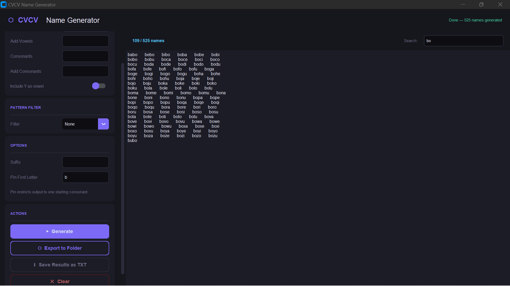

# namebro

> A fast, filterable CVCV name generator with a polished desktop GUI — built for naming projects, products, brands, and characters.



---

## What is CVCV?

CVCV stands for **Consonant–Vowel–Consonant–Vowel** — the pattern behind most short, pronounceable, memorable names. Think: *koda*, *neva*, *zuri*, *filo*. namebro generates every permutation of this pattern from a configurable letter set, with filters, suffixes, and export options baked in.

---

## Features

- **Full letter set control** — customize vowels, consonants, or layer on additions without replacing defaults
- **Pattern filters** — narrow output to repeating vowels (`kaka`), repeating consonants (`baba`), or both (`mama`)
- **Suffix support** — append `.io`, `ly`, `ai`, or anything else to every result
- **Pin first letter** — restrict generation to a single starting consonant
- **Live search** — filter thousands of results in real time without regenerating
- **Grouped export** — writes one `.txt` per starting letter into any folder you choose
- **Desktop GUI** — built with CustomTkinter; dark-themed, responsive, threaded generation

---

## Installation

Requires Python 3.10+. Uses [uv](https://github.com/astral-sh/uv) for dependency management.

```bash
git clone https://github.com/yourname/namebro
cd namebro
uv sync
```

---

## Usage

### GUI

```bash
uv run main.py
```

### CLI

```bash
uv run gename.py [options]
```

| Flag | Description | Example |
|---|---|---|
| `--vowels` | Replace default vowel set | `--vowels aei` |
| `--add-vowels` | Append to default vowels | `--add-vowels y` |
| `--consonants` | Replace default consonant set | `--consonants bcdkpr` |
| `--add-consonants` | Append to default consonants | `--add-consonants ng` |
| `--include-y` | Treat Y as a vowel | `--include-y` |
| `--first` | Pin starting consonant | `--first k` |
| `--suffix` | Append to every name | `--suffix .io` |
| `--filter` | Pattern filter (see below) | `--filter repeat_vowels` |
| `--export` | Write grouped `.txt` files to `output/` | `--export` |
| `--clear` | Delete existing output files | `--clear` |

**Filter options:** `none` · `repeat_vowels` · `repeat_consonants` · `repeat_both`

#### Examples

```bash
# All default CVCV names
uv run gename.py

# Names starting with 'k', vowels a/e/i only, with .io suffix
uv run gename.py --first k --vowels aei --suffix .io

# Repeating-vowel names (e.g. neva, keka, zizi)
uv run gename.py --filter repeat_vowels

# Export grouped by first letter
uv run gename.py --export

# Wipe output folder and re-export with new settings
uv run gename.py --clear --export --consonants bdfklmnprst
```

---

## Project Structure

```
namebro/
├── main.py          # Desktop GUI (CustomTkinter)
├── gename.py        # CLI entry point
├── pyproject.toml
├── uv.lock
└── github/
    └── demo.png
```

---

## License

MIT